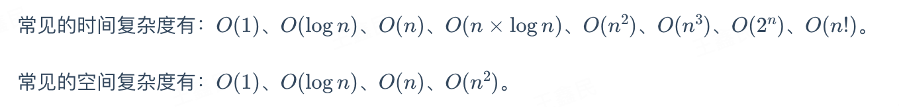
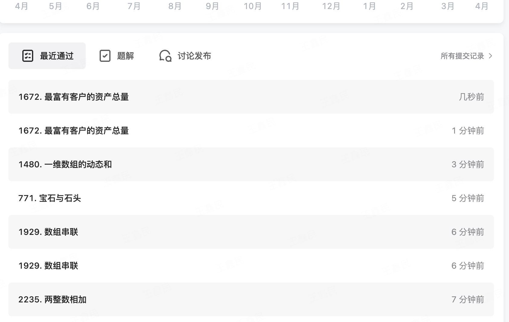

# 数据结构与算法简介
> 以下是核心内容，datawhale的大佬把leetcode算法笔记文档优化的非常棒，感觉几段总结是最好的归纳文字，直接引用附上一些自己的理解。

## 数据结构总结

数据结构可以分为 「逻辑结构」 和 「物理结构」。
- 逻辑结构可分为：集合结构、线性结构、树形结构、图形结构。
- 物理结构可分为：顺序存储结构、链式存储结构。
「逻辑结构」指的是数据之间的 关系，「物理结构」指的是这种关系 在计算机中的表现形式。

## 算法总结

算法指的就是解决问题的方法。算法是一系列的运算步骤，这些运算步骤可以解决特定的问题。
- 算法拥有 5 个基本特性：输入、输出、有穷性、确定性、可行性。
- 算法追求的目标有 5 个：正确性、可读性、健壮性、所需运行时间更少（时间复杂度更低）、占用内存空间更小（空间复杂度更低）。

## 算法复杂度

需要综合考虑时间复杂度与空间复杂度，大O表示法忽略n前面的常数项和低阶项，只考虑最高阶幂。


## LeetCode刷题技巧
chatgpt是非常好的算法老师。

基础的数据结构和算法知识包括：
- 常考的数据结构：数组、字符串、链表、树（如二叉树） 等。
- 常考的算法：分治算法、贪心算法、穷举算法、回溯算法、动态规划 等。

对刷题的理解：
- 在刷题时，重要的不仅仅是解题，更重要的是理解和掌握问题背后的数据结构和算法知识。
- 尝试多种解题方法，比较不同方法的效率，理解并掌握最优解法。
- 刷题不在于数量，而在于质量。对每一道题目，都要深入理解，掌握其解题思路和方法，必要时进行反复练习，直到能够熟练掌握。

附上本节刷题的记录吧～


## 习题讨论
771. 宝石与石头

 给你一个字符串 jewels 代表石头中宝石的类型，另有一个字符串 stones 代表你拥有的石头。 stones 中每个字符代表了一种你拥有的石头的类型，你想知道你拥有的石头中有多少是宝石。

字母区分大小写，因此 "a" 和 "A" 是不同类型的石头。

```python
class Solution:
    # 哈希集合
    def numJewelsInStones(self, jewels: str, stones: str) -> int:
        jewels_set = set(jewels)
        return sum(s in jewels_set for s in stones)
    
    # 暴力解法
    def numJewelsInStones(self, jewels: str, stones: str) -> int:
        return sum(s in jewels for s in stones)
```
Q1：两种解法有什么区别？为什么不可以直接做 s in jewels的判定，而要将jewels转为set？

A1：in的操作对str的时间复杂度是O(n)，对set的时间复杂度是O(1)，如果str特别长，直接做s in str 可能效率会比较低，不过该题中，因为jewels比较短，在最终的评估中直接用s in str反而耗时更短。

Q2：return sum(s in jewels_set for s in stones)这段代码是在做什么？有什么相关的知识点？ --生成器表达式

A2：1. 使用了Python的生成器表达式和sum函数，对stones中每一个元素依次进行s in jewels_set的运算，然后sum函数会将序列中的所有元素相加；
2. 在表达式sum(s in jewels_set for s in stones)中，(s in jewels_set for s in stones)是一个生成器表达式。这个生成器表达式会生成一个迭代器，这个迭代器在每次迭代时，都会计算并产生一个新的值，这个值是布尔值，表明s是否在jewels_set中，然后，sum函数会使用这个迭代器，通过不断调用next方法，来获取并累加所有的值。

## 本节思考
- 关于知识点：数据结构的分类、算法的特性等、算法复杂度。
- 关于练习题：还是要在刷题中多思考数据结构与算法，优化时间复杂度和空间复杂度，如：对于二维数组accounts(m * n)，max(sum(row) for row in accounts)的时间复杂度是O(mn)。